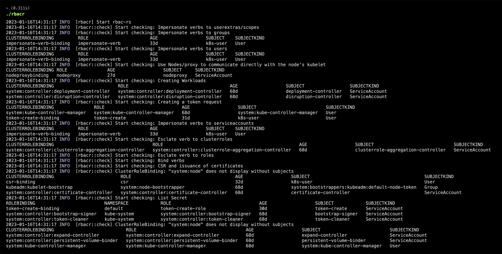

# RBACR

---

针对Kubernetes中的RBAC可能被攻击检测工具，根据检查项将集群中RBAC配置存在风险的`RoleBinding`和`ClusterRoleBinding` 展示出来。



## 安装

---

本项目使用Github Actions自动构建二进制程序，可以去[releases](https://github.com/ZhuriLab/rbacr/releases)下载最新。


## 从源码编译

1. 该项目采用Rust编写，首先需要Rust语言的开发环境，参考官网[Install Rust](https://www.rust-lang.org/tools/install)。
2. 使用如下命令编译

```bash
$ cargo build --release --locked
```


## 使用

---

```bash
$ ./rbacr
2023-01-16T14:31:17 INFO  [rbacr] Start rbac-rs
2023-01-16T14:31:17 INFO  [rbacr::check] Start checking: Impersonate verbs to userextras/scopes
2023-01-16T14:31:17 INFO  [rbacr::check] Start checking: Impersonate verbs to groups
CLUSTERROLEBINDING         ROLE                       AGE                  SUBJECT    SUBJECTKIND
impersonate-verb-binding   impersonate-verb           33d                  k8s-user   User
2023-01-16T14:31:17 INFO  [rbacr::check] Start checking: Impersonate verbs to users
CLUSTERROLEBINDING         ROLE                       AGE                  SUBJECT    SUBJECTKIND
impersonate-verb-binding   impersonate-verb           33d                  k8s-user   User
2023-01-16T14:31:17 INFO  [rbacr::check] Start checking: Use Nodes/proxy to communicate directly with the node's kubelet
CLUSTERROLEBINDING ROLE               AGE                  SUBJECT     SUBJECTKIND
nodeproxybinding   nodeproxy          27d                  nodeproxy   ServiceAccount
2023-01-16T14:31:17 INFO  [rbacr::check] Start checking: Creating Workloads
CLUSTERROLEBINDING                        ROLE                                      AGE                  SUBJECT                 SUBJECTKIND
system:controller:deployment-controller   system:controller:deployment-controller   68d                  deployment-controller   ServiceAccount
system:controller:disruption-controller   system:controller:disruption-controller   68d                  disruption-controller   ServiceAccount
2023-01-16T14:31:17 INFO  [rbacr::check] Start checking: Creating a token request
CLUSTERROLEBINDING               ROLE                             AGE                  SUBJECT                          SUBJECTKIND
system:kube-controller-manager   system:kube-controller-manager   68d                  system:kube-controller-manager   User
token-create-binding             token-create                     31d                  k8s-user                         User
2023-01-16T14:31:17 INFO  [rbacr::check] Start checking: Impersonate verbs to serviceaccounts
CLUSTERROLEBINDING         ROLE                       AGE                  SUBJECT    SUBJECTKIND
impersonate-verb-binding   impersonate-verb           33d                  k8s-user   User
2023-01-16T14:31:17 INFO  [rbacr::check] Start checking: Esclate verb to clusterroles
CLUSTERROLEBINDING                                     ROLE                                                   AGE                  SUBJECT                              SUBJECTKIND
system:controller:clusterrole-aggregation-controller   system:controller:clusterrole-aggregation-controller   68d                  clusterrole-aggregation-controller   ServiceAccount
2023-01-16T14:31:17 INFO  [rbacr::check] Start checking: Esclate verb to roles
2023-01-16T14:31:17 INFO  [rbacr::check] Start checking: Bind verbs
2023-01-16T14:31:17 INFO  [rbacr::check] Start checking: CSR and issuance of certificates
2023-01-16T14:31:17 INFO  [rbacr::check] ClusterRoleBinding: "system:node" does not display without subjects
CLUSTERROLEBINDING                         ROLE                                       AGE                  SUBJECT                                           SUBJECTKIND
csr-binding                                csr                                        32d                  k8s-user                                          User
kubeadm:kubelet-bootstrap                  system:node-bootstrapper                   68d                  system:bootstrappers:kubeadm:default-node-token   Group
system:controller:certificate-controller   system:controller:certificate-controller   68d                  certificate-controller                            ServiceAccount
2023-01-16T14:31:17 INFO  [rbacr::check] Start checking: List Secret
ROLEBINDING                          NAMESPACE            ROLE                                 AGE                  SUBJECT            SUBJECTKIND
token-create-binding                 default              token-create-role                    30d                  token-create       ServiceAccount
system:controller:bootstrap-signer   kube-system          system:controller:bootstrap-signer   68d                  bootstrap-signer   ServiceAccount
system:controller:token-cleaner      kube-system          system:controller:token-cleaner      68d                  token-cleaner      ServiceAccount
2023-01-16T14:31:17 INFO  [rbacr::check] ClusterRoleBinding: "system:node" does not display without subjects
CLUSTERROLEBINDING                           ROLE                                         AGE                  SUBJECT                          SUBJECTKIND
system:controller:expand-controller          system:controller:expand-controller          68d                  expand-controller                ServiceAccount
system:controller:persistent-volume-binder   system:controller:persistent-volume-binder   68d                  persistent-volume-binder         ServiceAccount
system:kube-controller-manager               system:kube-controller-manager               68d                  system:kube-controller-manager   User
```


## 检测

主要检测如下内容，具体利用参考文章。

- Nodes/proxy
- 列举Secret
- 创建工作负载
- 创建持久卷
- Esclate verb
- Bind verb
- Impersonate verb
- CSR和签发证书
- 令牌请求


如需修改或者添加检测内容，可参考`fixtures/check.yaml`内容进行修改和添加。


## 反馈

工具使用中出现问题的，可以提交`Issues` 或者`Pr`。

